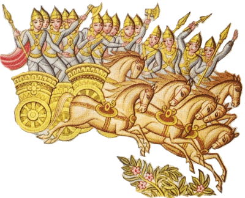

---
title: क ईं व्यक्ताः
unicode_script: devanagari  
emphasis_as_inline_comments: true
---   

## ऋक्

*([सायणो [ऽत्र](https://archive.org/details/SamaVedaSanhitaWithSayanabhashyaVolume1SatyavrataSamasrami1874bis/page/n941) कौथुमभाष्ये। वसिष्ठः। द्विपदा। मरुतः।])*

१ ५ १ ०५०७  
क*(य्)* ईं व्यक्ता नरः*(=नेतारः)* सनीडा रुद्रस्य मर्या*(=मर्त्येभ्यो [हिताः])* अथ स्वश्वाः॥

## साम १
- पारम्परिकगानमूलम् - [२०१५](https://archive.org/stream/sAmaveda-jaiminIya-paravastu-paramparA-docs/UDAKA%20SAANTHI%20SAAMAANI#page/n2/mode/1up&sa=D&ust=1542425956390000)।]
- गोपालार्यः 2015  

का*([])*ई, इ०व्या, अक्ता: । न*([])*रस्सा , अ*([])*नाइडा: । रु*([])*द्रस्समर्या, 
अ: । आ,*([])*अधाअअ  औहोवाअ । सु*([])*वा, आश्वा: ॥

## साम २
- गोपालार्यः 2015  

क*([])*ई, इइ०, विया,क्ता: ।  न*([])*रा, अस्सा, नीडा:  । रु*([])*द्र , स्सामाआर्या, अ: । 
आ,*([])*अधा, अअ  औहोवाअ । सु*([])*वाआश्वा: ॥

   
## साम ३
- गोपालार्यः 2015  

का*([])*ई, इ० ।  वि*([])*या, अओ,*([])*वाअ । आ*([])*क्ता: ।  नारा:*([])*। स*([])*ना । 
आ*([])*ओ, वाअ । आ*([])*इडा: । रू*([])*द्रा: । स*([])*मा, आओ,*([])*वाअ  । आ*([])*
र्या: । आ*([])*धा: । सु*([])*वा, आओ,*([])*वाअ । आ*([])*श्वा: । हो*([])*इ । 
डा*([])*अ ॥

