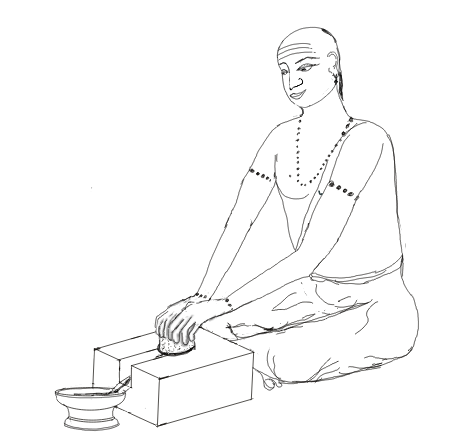

---
title: अपि प्रियाणि पवते 
unicode_script: devanagari  
emphasis_as_inline_comments: true
---   

## ऋक्

*([सायणो [ऽत्र](https://archive.org/details/SamaVedaSanhitaWithSayanabhashyaVolume2SatyavrataSamasrami1876bis_201803/page/n191) कौथुमभाष्ये। कविः। जगती। सोमः।])*

१ ६ २ ०७०१   
अभि प्रियाणि *(उदकानि)* पवते चनो*(=अन्न)*हितो नामानि*(=नमनशीलानि)* यह्वो*(=महान्)* अधि येषु वर्धते *(अन्तरिक्षस्थः)* ।  
आ सूर्यस्य बृहतो बृहन्नधि रथं विष्वञ्चम्*(=विष्वग्गमनं)* अरुहद् विचक्षणः॥

## साम
- पारम्परिकगानमूलम् - [२०१५](https://archive.org/stream/sAmaveda-jaiminIya-paravastu-paramparA-docs/UDAKA%20SAANTHI%20SAAMAANI#page/n2/mode/1up&sa=D&ust=1542425956390000)।]
- गोपालार्यः 2015  

कावम्।  
अ*([])*भ्यो,वाअ।  
प्रि*([])*याणि, पवताइ।  
च*([])*नो, हाइता*([])*ह*(v)*।  
ना*([])*मा,न्यह्वो, अधि याइ,,षु*([])*वर्धा, ता*([])*इ।  
आ,*([])* सू,र्यस्य, बृहतो।  
बृ*([])*ह०न्नाधीइ।  
रा,*([])*थाम्, वाइष्वाअँ,,च*([])*मरूहा,अत्।  
वा*([])*इ,चा,अक्षा,अ,णाङङाहा॥  