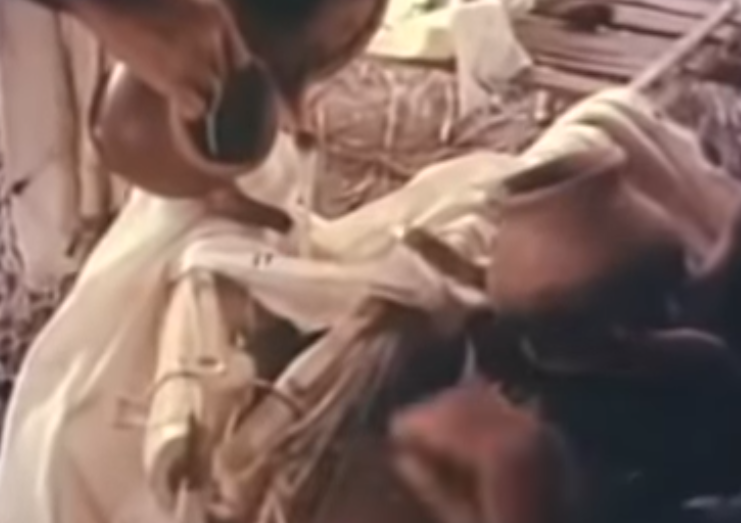

---
title: यौक्ताश्वम्
unicode_script: devanagari  
emphasis_as_inline_comments: true
---   

## ऋक्

१ ५ २ ०९०३   
वृषा पवस्व धारया मरुत्वते च मत्सरः।  
विश्वा दधान ओजसा  ।

## साम - यौक्ताश्वाद्यम्
- पारम्परिक-लेखाः - [२०१५](https://archive.org/stream/sAmaveda-jaiminIya-paravastu-paramparA-docs/UDAKA%20SAANTHI%20SAAMAANI#page/n4/mode/1up)।
- गोपालार्यः 2015  

यौक्ता*("३)*श्वाद्यम्।  
औ*(["पै])*हॊहोहा*(v३)*इ, वॄ*([क]%)*षा*(")*अ ।  
प*([पौ])*वस्वा*([ण]")*अ धा*([ऽ]%)*रा*([ऽ]--%३)*,या*(-"३)*अ।  
मा*([पृ])*रू*("३)*उत्वा*(%)*ता*(")*इ ।  ओ*([त]"३)*इ ।  
चा*([घं])*आ*(%)* मा*("३)*अ,, च*([पॄ])*मा*("३)*अत्सा*(%)*राह*(v)*।

औ*(["पै])*हॊहोहा*(v३)*इ, वि*([का]%)*श्वा*(")*अ ।  
द*([पॄ])*धा*("३)*अना*(%)*ओऒ,,जा*([गे]v-४)*,सा*(v-४)*,  
औहो*("%३)*वा*(-")*अ ।  
ओ*([प]")*इ । ज्वा*([पे]४)*,रा*(४)*,आ ॥

## साम - यौक्ताश्वोत्तरम्
- पारम्परिक-लेखाः - [२०१५](https://archive.org/stream/sAmaveda-jaiminIya-paravastu-paramparA-docs/UDAKA%20SAANTHI%20SAAMAANI#page/n4/mode/1up)।
- गोपालार्यः 2015  

यौक्ता*("३)*श्वोत्तरम् ।  
वृ*([पै])*षा*(["]३)*, औ*(["])*,हॊ*(["])*हो*(%)*हाइ ।  
प*([टी])*वा*(")*अ*([ण])*स्वा*("३)*अ, धआरया*("३)*अ।  
मा*([पृ]%)*रू*(-"३)*उत्वा*(%)*ता*(")*इ।  
चा*([टी]v३)* मा*(")*अ,,ओ*([त]"३)*इ,, चा,*([घं])* आ*(%)*मा*("३)*अत्साराह*(v)*।

वि*([पै])*श्वा*(["]३)*, औ*(["])*हॊ*(["])*, हो, हाइ ।  
द*([पृ])**धा*("३)*अना*(%)*ओ,ऒ,,जा*("३)*अ*([पे])*सा*(v)*अअअ,  
औ*(["])*हो*(["]%)* वा*(-")*अ ।  
ओ*([प])*इ, जू*([टू]%३)*वा*(")*अ  ॥
